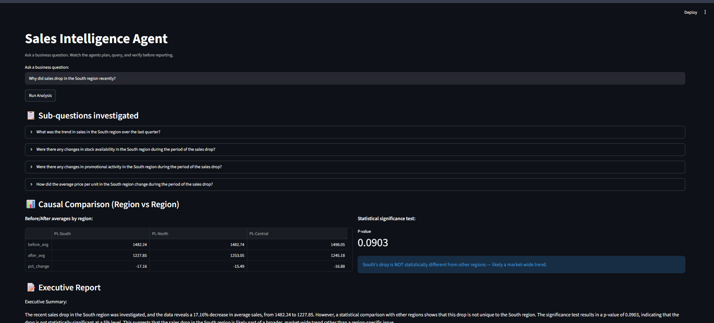
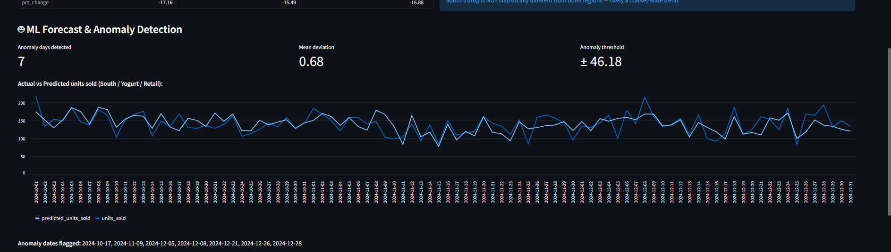

# Sales Intelligence Agent

An agentic AI system that investigates business questions about FMCG sales data — planning sub-questions, querying a real database, running statistical causal analysis, and verifying its own conclusions before reporting.

## What it does

Ask a question like *"Why did sales drop in the South region recently?"* and the system:

1. **Plans** — breaks the question into specific, data-answerable sub-questions
2. **Queries** — writes and executes SQL against a real sales database, with automatic self-correction if a query fails
3. **Tests causally** — runs a statistical (t-test) comparison across regions to check whether a trend is region-specific or market-wide, rather than relying on correlation alone
4. **Reports** — synthesizes findings into an executive summary
5. **Verifies** — independently checks each claim in the report against the specific data it's supposed to be based on, flagging unsupported or partially-supported statements

## Why this is different from a typical LLM chatbot project

Most "AI agent" projects are a single LLM call wrapped in a chat UI. This system:
- Actually executes queries against real data rather than generating answers from memory
- Uses a genuine statistical test (Welch's t-test) to distinguish a real regional anomaly from normal market-wide variation
- Includes a verification step that checks report claims against their *specific* source data — catching cases where the reporting agent overreaches beyond what any single query actually supports




## Architecture
User question
↓
Planner Agent        → breaks question into sub-questions
↓
Data Agent           → writes SQL, executes, self-corrects on error
↓
Causal Agent         → region vs. region statistical comparison (t-test)
↓
Forecast Agent       → trained XGBoost model, predicts actual vs expected units_sold, flags anomaly days
↓
Reporter Agent       → synthesizes findings into an executive summary
↓
Verifier Agent       → checks each claim against its specific source data
↓
Streamlit UI

## Forecast & Anomaly Detection

A trained XGBoost model predicts expected daily units_sold using calendar features (day of week, month), lag features (7/14/28-day lags), rolling statistics, price, promotion flags, and stock availability. Actual sales are compared against predictions — days where the deviation exceeds 2 standard deviations of the model's historical residual error are flagged as anomalies.

Three models were compared on a time-based train/test split (train: 2022–2023, 25,013 rows; test: 2024, 15,982 rows — never randomly split, to avoid leaking future information into training):

| Model | MAE | RMSE |
|---|---|---|
| Linear Regression | 19.09 | 25.81 |
| Decision Tree | 17.64 | 24.86 |
| XGBoost | **16.43** | **23.15** |

XGBoost was selected based on lowest MAE on the held-out 2024 test set — a ~14% improvement over the linear baseline, reflecting its ability to capture non-linear interactions between promotions, seasonality, and pricing that simpler models miss.

## Tech stack

- **LLM**: Groq API (Llama 3.3 70B) — used for planning, SQL generation, report writing, and verification
- **Database**: SQLite
- **Statistics**: SciPy (Welch's t-test for causal comparison)
- **UI**: Streamlit
- **Data**: [FMCG/retail sales dataset — (https://www.kaggle.com/code/mishashikhov/fmcg-sales-forecasting-ml-case-study/input)]

## Project structure

sales-intelligence-agent/
├── agents/
│   ├── planner.py       # breaks question into sub-questions
│   ├── data_agent.py     # SQL generation + execution + self-correction
│   ├── causal_agent.py   # statistical region comparison
│   ├── reporter.py        # executive summary generation
│   └── verifier.py       # claim verification against source data
├── data/
│   └── raw_sales.csv     # source dataset (sales.db generated from this)
├── graph.py              # orchestrates the full pipeline
├── load_data.py           # loads CSV into SQLite
├── app.py                 # Streamlit UI
└── requirements.txt

## How to run it

1. Clone the repo and create a virtual environment:
```bash
python -m venv venv
venv\Scripts\activate      # Windows
source venv/bin/activate   # Mac/Linux
```

2. Install dependencies:
```bash
pip install -r requirements.txt
```

3. Add your Groq API key to a `.env` file:

GROQ_API_KEY=your_key_here

4. Load the dataset:
```bash
python load_data.py
```

5. Run the pipeline in terminal:
```bash
python graph.py
```

Or launch the UI:
```bash
streamlit run app.py
```

## Example finding

For the question *"Why did sales drop in the South region recently?"*, the system found that all three regions (South, North, Central) dropped by a similar magnitude (15–17%), and a t-test confirmed South's decline was **not statistically different** from the others (p=0.09). This redirected the investigation from "what's wrong in the South" to "what changed market-wide" — a more accurate framing than the original question assumed.

## Known limitations / future work

- The Verifier currently checks each claim against one data source at a time; a future version could trace exactly which claim came from which source automatically
- Forecast Agent (trained ML model for demand prediction) is a planned addition
- Causal comparison currently uses a fixed before/after split date; could be made dynamic based on detected anomaly points

## Author

Aaryan Mohanty — built as part of ML/Agentic AI internship preparation